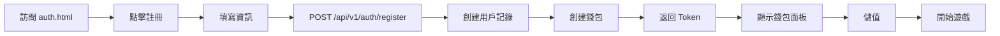
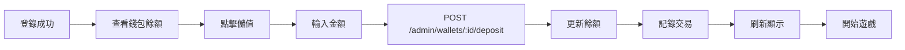
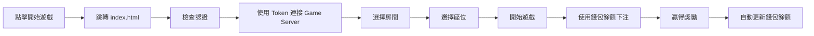

# 🎮 捕魚遊戲 - 認證與錢包系統使用指南

## 📋 功能概述

本系統實現了完整的前端認證、註冊、登錄和錢包管理功能，所有操作都通過 Admin Server API 進行，並自動記錄到資料庫中。

## 🚀 快速開始

### 1. 啟動服務

```bash
# 啟動資料庫服務（PostgreSQL + Redis）
make run-dev
# 或 Windows: scripts\start-database.bat

# 執行資料庫遷移
make migrate-up

# 啟動 Admin Server（端口 6060）
make run-admin

# 啟動 Game Server（端口 9090）
make run-game
```

### 2. 訪問認證頁面

打開瀏覽器訪問：
- **認證頁面**: http://localhost:6060/test-client/auth.html
- **遊戲頁面**: http://localhost:6060/test-client/index.html （需要先登錄）

## 🎯 功能說明

### 一、用戶認證系統

#### 1. 註冊新用戶

**步驟：**
1. 打開 `auth.html` 頁面
2. 點擊「註冊」標籤
3. 填寫：
   - 使用者名稱（至少 3 個字符）
   - 密碼（至少 6 個字符）
   - 確認密碼
   - 暱稱（選填）
4. 點擊「註冊」按鈕

**API 調用：**
```
POST /api/v1/auth/register
Body: {
  "username": "player1",
  "password": "password123",
  "nickname": "超級玩家"
}
```

**成功後：**
- 自動登錄並獲得 JWT Token
- 跳轉到主面板顯示錢包資訊
- Token 保存在 localStorage 中

#### 2. 用戶登錄

**步驟：**
1. 打開 `auth.html` 頁面
2. 在「登入」標籤填寫：
   - 使用者名稱
   - 密碼
3. 點擊「登入」按鈕

**API 調用：**
```
POST /api/v1/auth/login
Body: {
  "username": "player1",
  "password": "password123"
}
```

**成功後：**
- 獲得 JWT Token
- 自動獲取用戶資料
- 顯示錢包餘額
- 可以開始遊戲

#### 3. 遊客模式

**特點：**
- 無需註冊，一鍵進入
- 快速體驗遊戲功能
- ⚠️ 數據不會永久保存

**步驟：**
1. 打開 `auth.html` 頁面
2. 點擊「遊客模式」標籤
3. 點擊「以遊客身份進入」按鈕

**API 調用：**
```
POST /api/v1/auth/guest-login
```

### 二、錢包管理系統

#### 1. 查看錢包餘額

登錄後自動顯示在主面板頂部，包括：
- 目前餘額（大字顯示）
- 幣種（CNY）

**API 調用：**
```
GET /admin/players/{user_id}/wallets
```

#### 2. 儲值（充值）

**步驟：**
1. 在主面板點擊「💳 儲值」卡片
2. 輸入儲值金額（必填）
3. 輸入備註（選填）
4. 點擊「確認儲值」

**API 調用：**
```
POST /admin/wallets/{wallet_id}/deposit
Body: {
  "amount": 100.00,
  "description": "充值遊戲幣",
  "type": "user_deposit"
}
```

**資料庫記錄：**
- `wallets` 表更新餘額
- `transactions` 表新增一筆存入記錄
- 記錄類型：`user_deposit`

#### 3. 提款（提現）

**步驟：**
1. 在主面板點擊「💸 提款」卡片
2. 輸入提款金額（必填）
3. 輸入備註（選填）
4. 點擊「確認提款」

**API 調用：**
```
POST /admin/wallets/{wallet_id}/withdraw
Body: {
  "amount": 50.00,
  "description": "提現到銀行",
  "type": "user_withdraw"
}
```

**資料庫記錄：**
- `wallets` 表更新餘額（扣除金額）
- `transactions` 表新增一筆提取記錄
- 記錄類型：`user_withdraw`

#### 4. 交易記錄

**步驟：**
1. 在主面板點擊「📜 交易記錄」卡片
2. 查看交易歷史，包括：
   - 交易類型（存入/提取）
   - 交易金額
   - 交易前後餘額
   - 交易時間
   - 備註說明

**API 調用：**
```
GET /admin/wallets/{wallet_id}/transactions?limit=20&offset=0
```

**顯示內容：**
- 最近 20 筆交易
- 綠色：存入（+金額）
- 紅色：提取（-金額）
- 每筆交易顯示交易後餘額

#### 5. 刷新餘額

**步驟：**
1. 點擊「🔄 刷新餘額」卡片
2. 系統重新獲取最新餘額

**API 調用：**
```
GET /admin/wallets/{wallet_id}
```

### 三、開始遊戲

#### 1. 從認證頁面進入遊戲

**步驟：**
1. 登錄成功後，在主面板
2. 點擊底部大按鈕「🎮 開始遊戲」
3. 自動跳轉到遊戲頁面 `index.html`

#### 2. 遊戲頁面自動認證

遊戲頁面 (`index.html`) 會自動：
1. 檢查是否已登錄（檢查 localStorage 中的 Token）
2. 如果未登錄，重定向到 `auth.html`
3. 如果已登錄：
   - 自動使用 JWT Token 連接 Game Server
   - 顯示用戶資訊（右上角）
   - 顯示「登出」和「錢包」按鈕

**WebSocket 連接：**
```
ws://localhost:9090/ws?token={JWT_TOKEN}
```

#### 3. 遊戲中管理

在遊戲頁面右上角：
- **👤 用戶名**: 顯示當前登錄用戶
- **登出按鈕**: 清除認證資訊並返回登錄頁
- **錢包按鈕**: 返回錢包管理頁面

## 🔐 認證機制

### JWT Token 管理

**Token 生成：**
- 登錄/註冊成功後由 Admin Server 生成
- 包含用戶 ID、是否為遊客等資訊

**Token 存儲：**
```javascript
localStorage.setItem('auth_token', token);
localStorage.setItem('user_info', JSON.stringify(user));
localStorage.setItem('is_guest', 'false');
```

**Token 使用：**
- Admin API：`Authorization: Bearer {token}`
- Game Server：`ws://...?token={token}`

**Token 有效期：**
- 默認 2 小時（可在配置中修改）
- 過期後需要重新登錄

### 登出流程

1. 清除 localStorage 中的認證資訊
2. 重定向到 `auth.html` 登錄頁
3. 斷開 WebSocket 連接

## 📊 資料庫記錄

### 1. 用戶表（users）

註冊時創建記錄：
```sql
INSERT INTO users (username, password_hash, nickname, created_at, updated_at)
VALUES ('player1', '$2a$10$...', '超級玩家', NOW(), NOW());
```

### 2. 錢包表（wallets）

每個用戶自動創建錢包：
```sql
INSERT INTO wallets (user_id, balance, currency, status, created_at, updated_at)
VALUES (1, 0, 'CNY', 1, NOW(), NOW());
```

### 3. 交易記錄表（transactions）

每次儲值/提款都會記錄：
```sql
INSERT INTO transactions (
  wallet_id, amount, balance_before, balance_after,
  type, status, reference_id, description, created_at
)
VALUES (
  1, 100.00, 0, 100.00,
  'user_deposit', 1, 'REF123', '充值遊戲幣', NOW()
);
```

**交易類型：**
- `user_deposit` - 用戶儲值
- `user_withdraw` - 用戶提款
- `admin_deposit` - 管理員充值
- `admin_withdraw` - 管理員扣款
- `game_win` - 遊戲獲勝
- `game_bet` - 遊戲下注

## 🛠️ 技術架構

### 前端技術棧

- **HTML5 + CSS3**: 響應式設計
- **原生 JavaScript (ES6+)**: 無框架依賴
- **Fetch API**: HTTP 請求
- **WebSocket**: 遊戲通訊
- **localStorage**: 認證狀態持久化
- **Protobuf**: 遊戲消息序列化

### 後端 API 路由

#### 認證相關（不需要 Token）
- `POST /api/v1/auth/register` - 註冊
- `POST /api/v1/auth/login` - 登錄
- `POST /api/v1/auth/guest-login` - 遊客登錄

#### 用戶相關（需要 Token）
- `GET /api/v1/user/profile` - 獲取用戶資料
- `PUT /api/v1/user/profile` - 更新用戶資料

#### 錢包管理（需要 Token）
- `GET /admin/players/{id}/wallets` - 獲取玩家錢包列表
- `GET /admin/wallets/{id}` - 獲取錢包詳情
- `POST /admin/wallets/{id}/deposit` - 儲值
- `POST /admin/wallets/{id}/withdraw` - 提款
- `GET /admin/wallets/{id}/transactions` - 交易記錄

### 文件結構

```
js/
├── auth.html           # 認證和錢包管理頁面
├── auth-client.js      # Admin API 客戶端
├── index.html          # 遊戲客戶端頁面
├── game-client.js      # 遊戲 WebSocket 客戶端
└── game-renderer.js    # 遊戲渲染引擎
```

## 🔄 完整用戶流程

### 新用戶註冊流程



### 儲值遊戲流程



### 遊戲流程



## 🎨 UI 特性

### 1. 響應式設計
- 支持桌面端和移動端
- 自動適應不同屏幕尺寸

### 2. 美觀的漸變配色
- 主色調：紫色漸變 (#667eea → #764ba2)
- 綠色：成功/存入 (#28a745)
- 紅色：錯誤/提取 (#dc3545)
- 藍色：資訊 (#007bff)

### 3. 動畫效果
- 按鈕懸停效果
- 平滑過渡動畫
- 模態框淡入淡出

### 4. 用戶反饋
- 成功提示（綠色）
- 錯誤提示（紅色）
- 資訊提示（藍色）
- 載入狀態顯示

## 🐛 錯誤處理

### 常見錯誤及解決方案

#### 1. 「無法連接到伺服器」
**原因：** Admin Server 未啟動
**解決：**
```bash
make run-admin
```

#### 2. 「未找到錢包資訊」
**原因：** 用戶沒有關聯的錢包
**解決：** 通過管理員為用戶創建錢包

#### 3. 「Token 無效」
**原因：** Token 過期或被篡改
**解決：** 重新登錄

#### 4. 「餘額不足」
**原因：** 提款金額超過餘額
**解決：** 先儲值或減少提款金額

## 📝 開發注意事項

### 1. CORS 配置

Admin Server 已配置 CORS，允許所有來源：
```go
Access-Control-Allow-Origin: *
Access-Control-Allow-Methods: GET, POST, PUT, DELETE, OPTIONS
Access-Control-Allow-Headers: Origin, Content-Type, Accept, Authorization
```

### 2. 安全性

- 密碼使用 bcrypt 加密存儲
- JWT Token 包含過期時間
- 所有敏感操作需要 Token 認證
- SQL 注入防護（使用參數化查詢）

### 3. 擴展性

系統設計支持：
- 多幣種錢包（CNY, USD 等）
- 多種交易類型
- 更多支付方式整合
- 第三方 OAuth 登錄

## 🚀 後續優化建議

1. **支付整合**
   - 整合第三方支付（支付寶、微信支付）
   - 實現真實的儲值流程

2. **安全增強**
   - 添加二次驗證（2FA）
   - 實現交易密碼
   - 添加操作日誌

3. **用戶體驗**
   - 添加儲值優惠活動
   - 實現 VIP 等級系統
   - 每日簽到獎勵

4. **功能擴展**
   - 好友系統
   - 排行榜
   - 成就系統
   - 郵件系統

## 📞 支持與反饋

如有問題或建議，請聯繫開發團隊或提交 Issue。

---

**祝您遊戲愉快！🎮🐟**
